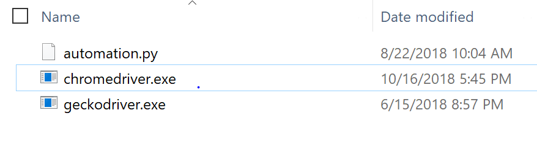
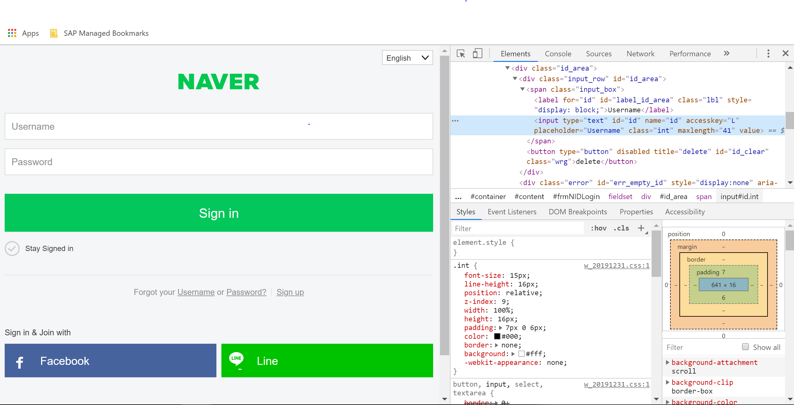
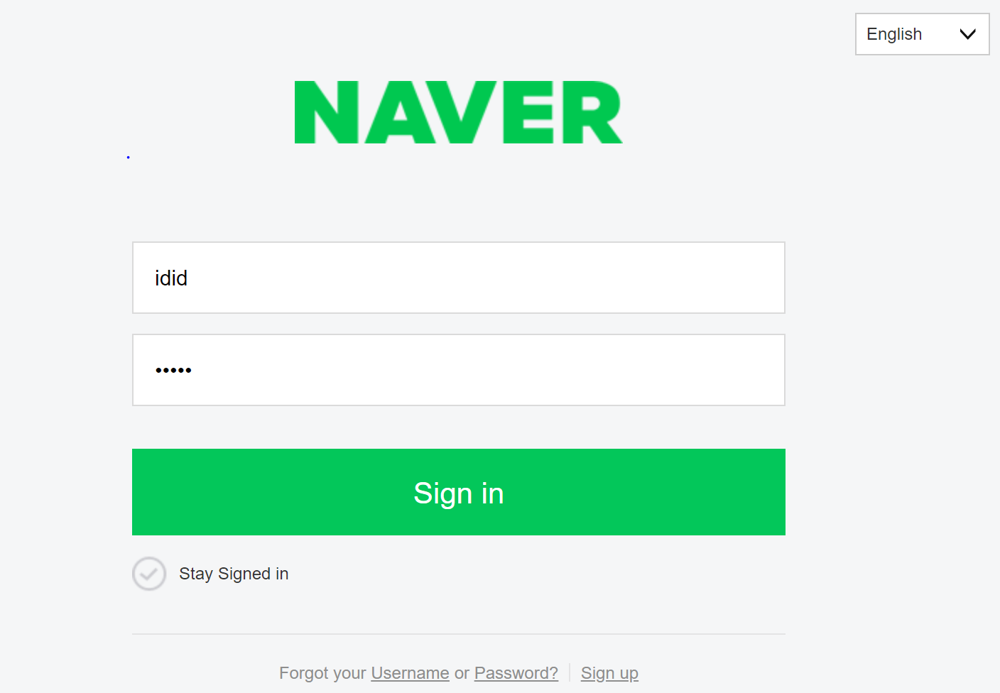

# Selenium이란?

Selenium은 웹 어플리케이션을 위한 테스팅 프레임워크다.
자동화 테스트를 위해 여러가지를 지원하는데, `webdriver`라는 API를 통해 운영체제에 설치된 Chrome등의 브라우저를 코드에서도 쉽게 제어할 수 있게 도와준다. 

브라우저를 직접 동작시킨다는 것은 JavaScript를 이용해 비동기적 혹은 뒤늦게 불러와지는 콘텐츠들을 가져올 수 있다. 
Selenium은 브라우저를 코드 내에서 돌린다고 생각하면 좋은데, 그래서 기존의 requests나 다른 것들에 비해 활용성이 높다.

# Selenium 설치하기

## 1. pip install selenium
먼저 Selenium을 설치하는 데에는 pip를 이용한다. 

```bash
pip install selenium
```

> 참고 : selenium의 버전은 자주 업데이트되고, 브라우저의 업데이트마다 새로운 driver를 잡아주기 때문에 항상 최신 버전을 깔아주는 것이 좋다.

## 2. webdriver 설치하기

Selenium은 `webdriver`라는 것을 통해 디바이스에 설치된 브라우저들을 제어할 수 있게 해준다. 

### Chrome WebDriver
크롬을 사용하려면 로컬에 크롬이 설치되어있어야 한다.
크롬을 설치했다고 가정하고, 크롬 드라이버를 다운로드 받아주자.

<https://sites.google.com/a/chromium.org/chromedriver/downloads>

어쩌구 저쩌구 버전과 운영체제를 선택하면 `chromedriver.exe`라는 파일이 저장된다.



저 파일이 있는 경로를 잘 알아두자. 나중에 Selenium 객체를 생성할 때 저장해주어야 한다.


# Selenium 시작하기
Selenium은 `webdriver api`를 통해 브라우저를 제어한다.

우선 `webdriver`를 import해주자.

```python
from selenium import webdriver

driver = webdriver.Chrome('/Users/Downloads/chromedriver') #아까 다운로드 받은 경로를 지정해줘야한다!
```

이제 특정 url로 브라우저를 켜보자.

```python
from selenium import webdriver

driver = webdriver.Chrome('/Users/Downloads/chromedriver')
driver.get('https://google.com')
```

만약 chromedriver의 위치가 정확하다면 새 크롬 화면이 뜨고 구글 첫 화면으로 들어가질 것이다!

## selenium 주요 메서드
selenium은 driver 객체를 통해 여러가지 메소드를 제공한다.

- URL에 접근하는 api
    - get('https://url.com')
- 페이지의 단일 element에 접근하는 api
    - find_element_by_css_selector('#css > div.selector')
    - find_element_by_class_name('some_class_name')
    - find_element_by_tag_name('h1')

위 메소드들을 활용시 HTML 브라우저에서 파싱을 해준다. 좀 더 사용히 편리한 soup 객체를 이용하려면 `driver.page_source` API를 이용해 현재 렌더링 된 페이지의 elements를 모두 가져올 수 있다.


# 실습 - NAVER 로그인하기

대부분의 사이트의 경우, requests를 이용해 로그인 하는 것이 어렵다. 프론트단에서 JS처리를 통해 로그인 처리를 하기 때문인데, Selenium을 이용하면 아주 쉽게 로그인을 할 수 있다.

```python
from selenium import webdriver

driver = webdriver.Chrome('/Users/Downloads/chromedriver')
driver.get('https://nid.naver.com/nidlogin.login?mode=form&url=https%3A%2F%2Fwww.naver.com')
```



크롬 개발자용 도구(F12누르면 보인다)를 통해 username필드와 password필드를 보면 각각 `input#id.int`와 `input#pw.int`로 되어있고 id와 name 모두 id, pw로 되어있는 것을 확인할 수 있다.

`find_element_by_name`을 통해 아이디/비밀번호를 입력해주자.

```python
from selenium import webdriver

driver = webdriver.Chrome('/Users/Downloads/chromedriver')
driver.get('https://nid.naver.com/nidlogin.login?mode=form&url=https%3A%2F%2Fwww.naver.com')

#id와 password 부분을 찾고 값을 넣는 부분
driver.find_element_by_name('id').send_keys('YOUR_ID')
driver.find_element_by_name('pw').send_keys('YOUR_PASSWORD')
```



성공적으로 값이 입력된다.
Login 버튼도 눌러보자.

```python
from selenium import webdriver

driver = webdriver.Chrome('/Users/Downloads/chromedriver')
driver.get('https://nid.naver.com/nidlogin.login?mode=form&url=https%3A%2F%2Fwww.naver.com')
driver.find_element_by_name('id').send_keys('YOUR_ID')
driver.find_element_by_name('pw').send_keys('YOUR_PASSWORD')

# 로그인 버튼을 눌러주자
driver.find_element_by_xpath('//*[@id="frmNIDLogin]/fieldset/input').click()

```

잘 로그인이 될 것이다~~ㅎㅎ

> Reference
<https://beomi.github.io/gb-crawling/posts/2017-02-27-HowToMakeWebCrawler-With-Selenium.html>